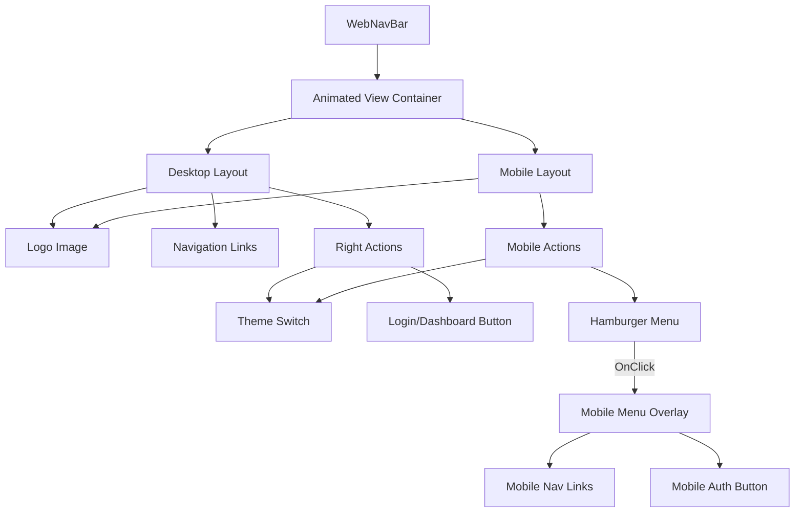

# Plan: Rewrite WebNavBar.tsx

Dieser Plan beschreibt den kompletten Rewrite der Navigationsleiste für `src/components/website/WebNavBar.tsx`.

## Ziel
Eine robuste, vereinfachte Navbar, die das neue Logo verwendet und eine immer sichtbare Login/Dashboard-Funktionalität bietet.

## Dateien
*   Ziel: `src/components/website/WebNavBar.tsx`
*   Logo: `src/assets/images/new_logo.png`

## Architektur

### Komponenten-Struktur


### Logik

#### 1. Navigation Handler
```typescript
const handleNavigation = (item) => {
  // Mobile Menu schließen
  setMobileMenuOpen(false);

  // Fall 1: Externe Seite (z.B. /ueber-uns)
  if (item.path) {
    router.push(item.path);
    return;
  }

  // Fall 2: Sektion auf Startseite (z.B. #features)
  if (pathname === '/') {
    // Scrollen wenn wir schon da sind
    const element = document.getElementById(item.id);
    if (element) element.scrollIntoView({ behavior: 'smooth' });
  } else {
    // Navigieren + Hash wenn wir woanders sind
    router.push(`/#${item.id}`);
  }
}
```

#### 2. Auth Handler
```typescript
const handleAuth = () => {
  if (user) {
    // User ist eingeloggt -> Dashboard
    router.push('/(tabs)');
  } else {
    // User ist nicht eingeloggt -> Google Login
    signInWithGoogle();
  }
}
```

## Styling
*   **Flexbox Layout:** `flexDirection: 'row'`, `justifyContent: 'space-between'`, `alignItems: 'center'`.
*   **Responsive:** `useWindowDimensions()` Hook verwenden. Breakpoint bei `768px`.
*   **Colors:** `Colors` aus `@/constants/Colors` und `isDark` Flag nutzen.
*   **Animation:** `react-native-reanimated` (`FadeInDown`) für Init-Load und Mobile Menu.

## Todo Schritte
1.  **Backup:** (Optional) Code kopieren, falls Referenz nötig.
2.  **Rewrite:** Datei leeren und neu aufbauen.
    *   Imports: React, RN, Router, Icons, Contexts.
    *   Konstanten: `navItems` Array.
    *   Component Body: Hooks initialisieren.
    *   Render Logic implementieren.
3.  **Logo:** `new_logo.png` einbinden (ResizeMode: 'contain', Height: ~40-50).
4.  **Test:** Prüfen ob Links scrollen/navigieren und ob Auth-Button korrekt umschaltet.
